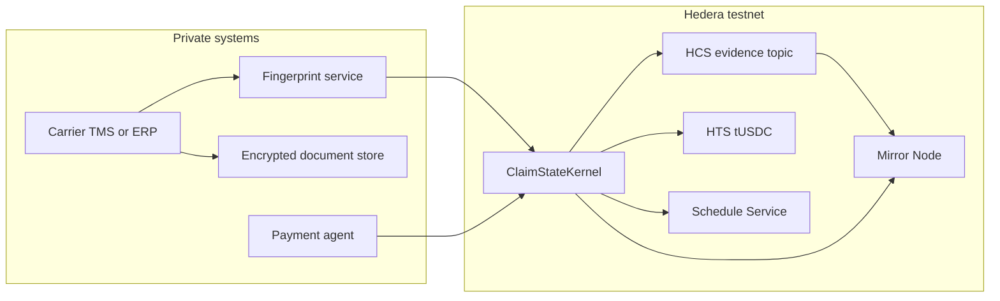
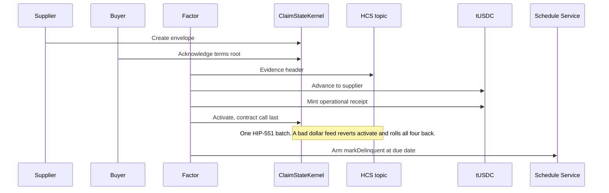
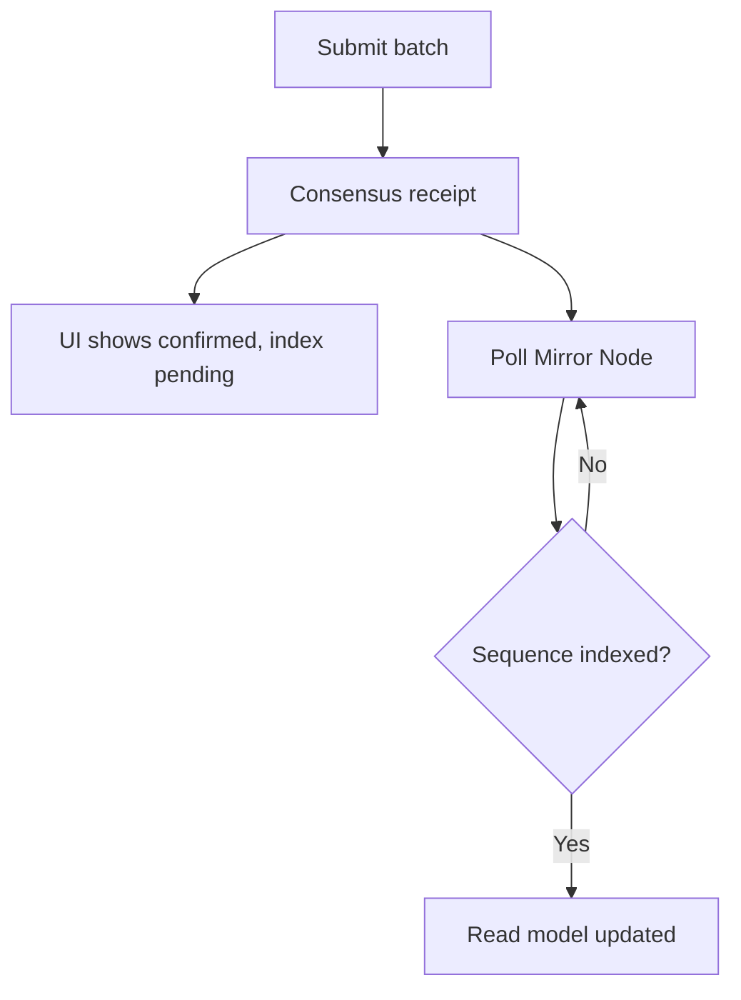
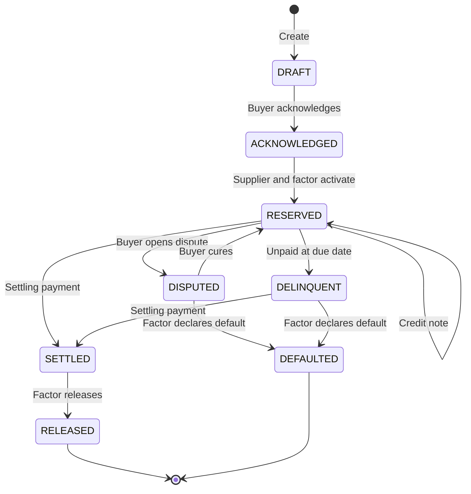

# ClaimState

A privacy-preserving obligation lifecycle and operational reservation engine built on Hedera.

In supply chain finance and transportation factoring, commercial documents like invoices and bills of lading contain sensitive pricing, customer names, and bank details. ClaimState lets suppliers, buyers, and financiers keep those documents private while recording a cryptographically verified, versioned state machine directly on Hedera.

Our reference implementation demonstrates a freight factoring workflow where a financier advances funds against a buyer-confirmed invoice. The core kernel is completely asset-agnostic: the same state machine can manage service level agreements, construction milestones, or performance bonds simply by swapping the evidence verification policy.

## The problem

Financing an invoice is rarely as simple as handling a single document. In real-world freight and B2B trade, information lives in silos:

- The original PDF invoice sits inside the carrier's Transportation Management System (TMS) or ERP.
- The freight broker or buyer confirms the load over email or through an internal web portal.
- The lender (factor) runs duplicate checks through specialized third-party services.
- Legal notices of assignment are sent back and forth between attorneys.
- Short-pays, billing disputes, and collection receipts get manually reconciled weeks later across disconnected spreadsheets and private databases.

Simply turning the invoice into an NFT does not solve this problem. While an NFT can easily be transferred between wallets, it cannot tell a lender whether the buyer actually approved the invoice, whether a credit note reduced the amount owed, or whether another lender already financed the same receivable within the network.

## What ClaimState solves

ClaimState introduces two foundational primitives:

1. **Obligation state envelope**: A versioned cryptographic container for commercial terms, participant roles, and signed lifecycle events. Instead of posting raw invoices or customer data on a public ledger, parties sign state transitions off-chain. Hedera stores Merkle roots and blind commitments, preserving business confidentiality while providing an immutable audit trail.

2. **Operational reservation**: A single, protected financing slot on that envelope. When a financier funds an invoice, their reservation lock and the digital payout occur together in a single atomic transaction batch. If a second financier attempts to fund the same invoice, the network rejects the transaction with `ALREADY_RESERVED` without leaking who holds the existing reservation.

The state envelope coordinates workflow and evidence among participants. Legal priority, perfection of liens, and UCC filings still depend on governing law and formal notices; those steps are handled by external adapters rather than smart contract state alone.

## What ClaimState is not

To keep the protocol focused, secure, and legally sound, ClaimState defines strict scope boundaries:

- **Not an open factoring marketplace or liquidity pool.** There is no automated market maker or native protocol token.
- **Not a standalone duplicate-invoice registry.** Production duplicate detection relies on specialized off-chain adapters (such as MonetaGo).
- **Not a global legal registry.** The contract cannot detect or stop a pledge made entirely outside participating systems.
- **Not a private payments rail.** Token transfers on-chain reveal transaction amounts, and off-chain fiat settlement is handled via signed lifecycle events rather than atomic bank wire integration.
- **Not an asset tokenization engine.** ClaimState coordinates obligations and evidence rather than issuing tokenized securities.

## Quick start

You can spin up a new project using the Scaffold-HBAR CLI or clone this repository directly:

```bash
npx create-scaffold-hbar@latest my-app --template U-GOD/ClaimState
cd my-app
cp .env.example .env.local          # add your testnet operator id and ECDSA key
npm install
npm run deploy:testnet               # deploy contract, topic, tUSDC, and receipt token
npm run demo:obligation              # walk one obligation from DRAFT to RELEASED
npm run verify:mirror                # confirm all 7 topic sequences on Mirror Node
npm run dev                          # start the demo UI at http://localhost:3000
```

`npm install`, `npm run lint`, `npm test`, and `npm run dev` work out of the box without requiring operator credentials.

To run the live testnet scripts (`deploy:testnet`, `demo:obligation`, `verify:mirror`), you will need a funded Hedera testnet account. You can grab free testnet HBAR directly from the [Hedera Portal faucet](https://portal.hedera.com/).

## Testnet deployment

The complete obligation lifecycle has been deployed and verified on the Hedera testnet (chain ID `296`).

| Resource | Testnet ID | HashScan Explorer |
|---|---|---|
| ClaimStateKernel | `0.0.10743893` | [View contract](https://hashscan.io/testnet/contract/0.0.10743893) |
| HCS evidence topic | `0.0.10743885` | [View topic](https://hashscan.io/testnet/topic/0.0.10743885) |
| tUSDC advance token | `0.0.10743886` | [View token](https://hashscan.io/testnet/token/0.0.10743886) |
| Operational receipt NFT | `0.0.10743889` | [View token](https://hashscan.io/testnet/token/0.0.10743889) |
| Chainlink USDC/USD feed | `0.0.4873353` | [View contract](https://hashscan.io/testnet/contract/0.0.4873353) |

In our end-to-end verification run, the full lifecycle reached `RELEASED` at version 7. All seven topic message sequences were confirmed through the Hedera Mirror Node. At activation, the Chainlink feed reported a live price of `99985881` (8 decimals, approximately $0.9999), satisfying the stablecoin peg check.

> **Legal notice:** Holding a demo token, an HTS operational receipt, or an HCS topic message does not constitute an assignment of receivables, a perfected lien under commercial law, or UCC Article 12 controllable electronic record control. See [LEGAL_BOUNDARIES.md](LEGAL_BOUNDARIES.md) for detailed regulatory guidance.

## Architecture

Private systems canonicalize commercial facts and retain original documents. `ClaimStateKernel` serves as the primary Solidity entrypoint inside the funding batch. Before reserving an obligation, it checks the Chainlink USDC/USD feed. If the oracle price is stale or falls outside the 2% peg boundary, the call reverts and rolls back the entire batch (the advance payment, the evidence message, and the receipt mint).

The Hedera Consensus Service establishes an immutable order for all evidence headers. A demo HTS fungible token (`tUSDC`, 2 decimals) disburses advances on testnet. The Schedule Service registers an automated due-date delinquency check after funding succeeds. Mirror Node provides the indexed read model.



### Funding batch

Activation is executed as one [HIP-551](https://github.com/hiero-ledger/hiero-improvement-proposals/blob/main/HIP/hip-551.md) `BatchTransaction` using `@hiero-ledger/sdk`. Four distinct actions are prepared, frozen, and bundled under a 6 KB outer transaction limit:

1. **HCS evidence header**: Records the schema version, event type, obligation ID, state transition, terms root, evidence hash, actor role, and a zeroed holder field.
2. **tUSDC advance**: Transfers 1,572,500 units ($15,725.00 at 2 decimals) to the supplier account.
3. **Receipt NFT mint**: Mints an operational receipt with metadata containing the obligation ID and `operational-receipt-not-title`.
4. **Contract call**: Invokes `ClaimStateKernel.activate()`, which validates Chainlink USDC/USD pricing and locks the state transition.

If any inner transaction fails, the entire batch rolls back automatically. The delinquency schedule is submitted as a separate transaction immediately after activation succeeds.



### Read path

Writing applications rely on the Hedera consensus receipt as the source of truth. The background indexer polls Mirror Node and flags entries as pending until the corresponding topic sequence number appears. A short delay right after consensus is expected while Mirror Node catches up. Keep in mind that Mirror REST responses provide indexed query data rather than portable cryptographic proofs.



## State machine

The envelope `version` starts at 1 upon creation and increments with each accepted transition. Submissions with a stale `expectedVersion` or replayed event IDs are rejected. Registering a `CreditNote` updates the terms root and amount commitment without minting a new obligation ID.



Attempting to call `Activate` from any state other than `ACKNOWLEDGED`, or while an active reservation holder already exists, reverts with `ALREADY_RESERVED`. To preserve confidentiality, the revert does not return the identity of the current holder.

| State | Meaning |
|---|---|
| `DRAFT` | Supplier created the envelope. The buyer has not signed yet. |
| `ACKNOWLEDGED` | Buyer signed the terms root. The reservation slot remains open. |
| `RESERVED` | One factor holds the reservation. Advance funds were disbursed in the same atomic batch. |
| `DISPUTED` | Buyer opened an active dispute. The reservation remains locked. |
| `DELINQUENT` | The invoice due date passed without a settling payment. |
| `SETTLED` | The payment agent confirmed full or final settlement. Awaiting factor release. |
| `RELEASED` | Terminal state. The slot is freed and cannot be re-reserved. |
| `DEFAULTED` | Terminal state. Preserved for dispute resolution and historical auditing. |

## Reference workflow

Private commercial records remain in the gitignored `data/private/` folder. In our testnet demo, a carrier issues a freight bill for **$18,500.00**. The factor advances **85%** (**$15,725.00**) in `tUSDC`. A subsequent **$500.00** short-pay is recorded via a credit note.

| Step | Who signs | On-chain result |
|---|---|---|
| 1 | Supplier | `DRAFT` envelope created. No invoice body on-chain. |
| 2 | Buyer | `ACKNOWLEDGED`. Terms root signed. |
| 3 | Fingerprint adapter | Signed duplicate-check committed as a hash. |
| 4 | Supplier + factor | Atomic batch: `RESERVED`, HCS header, tUSDC advance, receipt mint. |
| 5 | Second factor | Rejected: `ALREADY_RESERVED`. Holder identity not disclosed. |
| 6 | Buyer + supplier | Credit note. Version and terms root updated while state stays `RESERVED`. |
| 7 | Payment agent, then factor | `SETTLED`, followed by `RELEASED`. |

The HCS message records the schema version, event type, obligation ID, version, state transition, terms root, evidence hash, and actor role. It never exposes participant names, invoice numbers, bank routing information, or commercial pricing. The on-chain token transfer does reveal the advance amount; this visibility is accepted for the testnet demo and is not claimed as private.

## Identifiers

```text
domain = keccak256(
  "ClaimState/v1",
  chainId,
  registry,
  topicId,
  schemaVersion,
  networkLabel
)

blindedFingerprint = HMAC-SHA256(fingerprintKey, canonicalCommercialFields)
obligationId       = keccak256(domain, blindedFingerprint, buyer, supplier)
actionDigest       = keccak256(domain, eventType, obligationId, expectedVersion, payloadHash)
```

`obligationId` is never a plain hash of the invoice number. The HMAC key remains inside the fingerprint service to protect against rainbow table and dictionary attacks. Future deployments can swap HMAC for an Oblivious Pseudorandom Function (OPRF) or Hardware Security Module (HSM) behind the same `FingerprintProvider` interface.

In freight operations, `canonicalCommercialFields` includes the schema version, currency, amount in cents, due date, debtor reference, and carrier reference, serialized as sorted-key JSON without extraneous whitespace.

## Hedera services

| Service | Role |
|---|---|
| Smart Contract Service | `ClaimStateKernel` enforces state transition rules, version increments, and ECDSA signature recovery. `activate` verifies the Chainlink USDC/USD price feed and reverts `PriceUnavailable` if data is stale (over 48 hours) or drifts more than 2% from the $1 peg. |
| HIP-551 batch | Groups the evidence header, tUSDC advance, receipt NFT mint, and smart contract invocation into one atomic transaction. The contract call is always placed as the final inner transaction. |
| Consensus Service | Logs ordered evidence headers on an HCS topic with an operator submit key. Because topic message bodies are public, only cryptographic commitments and Merkle roots are written. |
| Token Service | Disburses advances via a demo stablecoin (tUSDC, 2 decimals) and issues one NFT operational receipt per activation. The receipt metadata explicitly states `operational-receipt-not-title`. Burning the receipt token does not release the contract reservation. |
| Schedule Service | Triggers a one-shot `markDelinquent` call once the invoice reaches its due date. |
| Mirror Node | Serves as the indexed query read model. Consensus receipts remain the authoritative write path. |
| Chainlink | Provides live USDC/USD price data on Hedera testnet (`0xb632a7e7e02d76c0Ce99d9C62c7a2d1B5F92B6B5`). The funding batch cannot reserve or disburse without an active, verified dollar peg. |

HBAR amounts in the SDK use 8 decimals, while `tUSDC` uses 2. Ethereum's default 18-decimal standard does not apply. Public Hashio serves as a development JSON-RPC endpoint. Scripts accept `HEDERA_RPC_URL` and default to Hashio strictly for local development.

## Repository layout

```text
packages/hardhat/     ClaimStateKernel contract, deploy scripts, and testnet demo scripts
packages/sdk/         Canonicalization, commitments, state machine, and HIP-551 batch builder
packages/indexer/     Mirror Node reconciler and read model
packages/nextjs/      Demo UI and obligation explorer
adapters/             Freight policy, mock fingerprint, duplicate-check, and payment agent
schemas/              Obligation, event, and evidence JSON schemas
.harness/             Hedera Harness spec and validators
```

`template.json` configures this repository for `create-scaffold-hbar` and is automatically stripped when users initialize new projects. The `scaffold:check` script confirms that installation, linting, testing, and Next.js production builds succeed cleanly after template configuration is removed.

`npm install`, `npm run lint`, `npm test`, and `npm run dev` all execute without requiring a Hedera operator key. The activation batch (including the receipt NFT mint) is capped at 6 KB.

## Environment variables

| Variable | Required for | Description |
|---|---|---|
| `HEDERA_OPERATOR_ID` | Testnet scripts | Hedera testnet account ID (for example, `0.0.12345`). |
| `HEDERA_OPERATOR_ECDSA_KEY` | Testnet scripts | Hex-encoded 32-byte ECDSA private key. Store exclusively in `.env.local`. |
| `HEDERA_CHAIN_ID` | Optional | EVM chain ID. Defaults to `296` (testnet). |
| `HEDERA_RPC_URL` | Optional | JSON-RPC endpoint. Defaults to `https://testnet.hashio.io/api`. |
| `HEDERA_MIRROR_BASE_URL` | Optional | Mirror Node REST endpoint. Defaults to `https://testnet.mirrornode.hedera.com`. |

Copy `.env.example` to `.env.local` and add your operator credentials. `.env.local` is gitignored and should never be checked into version control.

## Privacy and security

The protocol provides an immutable record of what participating parties have signed. It cannot physically verify whether freight was loaded onto a truck, nor can it stop colluding parties from signing a well-formed but fabricated obligation.

Key design boundaries include:

- **No invoice number hashing**: To prevent dictionary and rainbow table attacks, obligations use HMAC-based blind fingerprints rather than raw hashes. The fingerprint service remains a trusted component.
- **Off-registry financing**: The protocol can only track obligations and reservations generated within participating systems.
- **Mirror Node latency**: The front-end UI may briefly show pending status while Mirror Node indexes new events. Consensus receipts represent the immediate source of truth.
- **No pause key on receipt tokens**: Emergency administrative keys are intentionally omitted from operational receipts.
- **Delinquency schedules are not payment guarantees**: A scheduled `markDelinquent` invocation updates state on-chain, but does not execute automated debt collection.

See [THREAT_MODEL.md](THREAT_MODEL.md) for activation batch threat analysis, [SECURITY.md](SECURITY.md) for key handling and topic contents, and [LEGAL_BOUNDARIES.md](LEGAL_BOUNDARIES.md) for legal scope.

## License

Released under the [MIT License](LICENSE).
