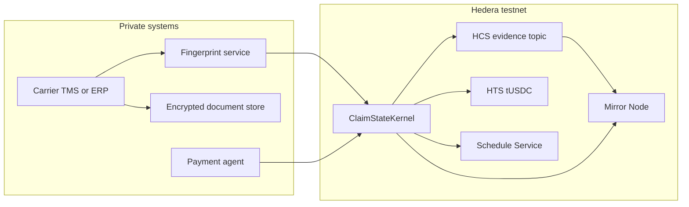
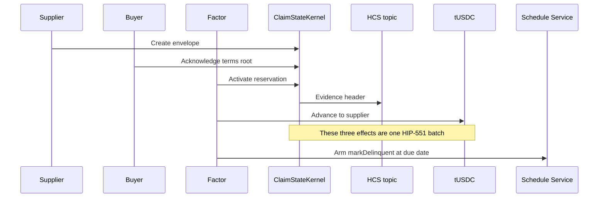
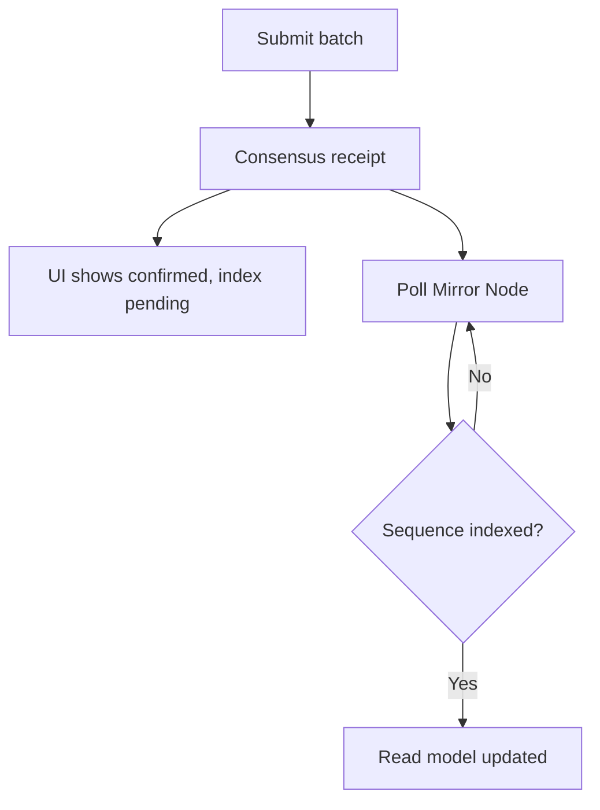
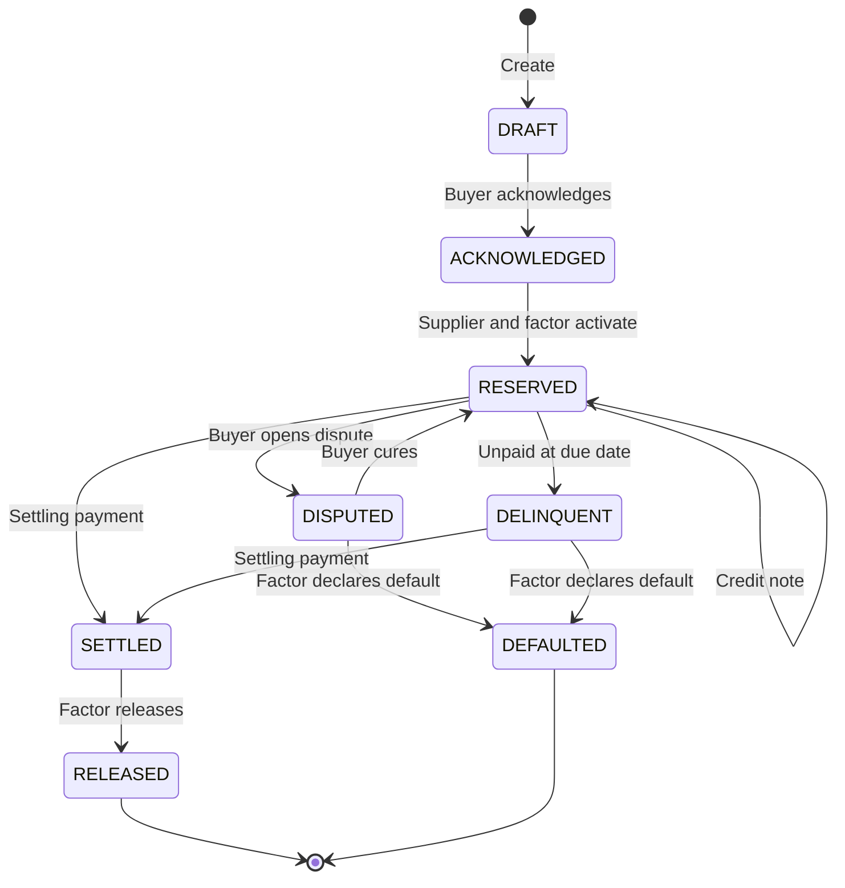

# ClaimState

ClaimState is a shared evidence layer for private financial obligations. A supplier, a buyer, and a financier keep the commercial document off the ledger. Hedera records a signed, versioned state envelope: acknowledgement, one in-network financing reservation, amendments, dispute, payment, and release.

The reference workflow is a U.S. transportation factor financing a buyer-confirmed freight invoice. The kernel itself is asset-independent. A later adapter, such as a compute SLA or a performance bond, changes the evidence policy without changing the state machine.

This repository is the protocol specification and the Scaffold-HBAR template for that kernel. The off-chain state machine and commitments live in `packages/sdk`. `ClaimStateKernel` lives in `packages/hardhat`. The indexer and the demo are not in the tree yet.

The research that selected this protocol is [docs/hedera-financial-infrastructure-research.canvas.tsx](docs/hedera-financial-infrastructure-research.canvas.tsx). Read that file before changing scope. It is a Cursor canvas: the same file is installed for the ClaimState workspace, and the copy in `docs/` is the reviewable source. It records the candidate set, the kill tests, the Hedera constraints, and the decision to ship an evidence envelope rather than a tokenized-invoice market.

## Status

| Item | State |
|---|---|
| Protocol decision | Written |
| Workspace skeleton and written invariants | Written |
| Off-chain state machine and commitments | Tested, no network |
| `ClaimStateKernel` | Local tests. Testnet deploy waits on an operator key |
| Activation batch | Built. Testnet funding waits on the same operator key |
| Indexer and demo UI | Not started |
| Target network | Hedera testnet, chain id 296 |
| License | Apache-2.0 |

Do not treat a deployed demo token, an HTS receipt, or a topic message as an assignment of a receivable, a perfected lien, or UCC Article 12 control.

## The problem

A financed invoice is not one record. The PDF sits in a carrier's transportation system. The broker confirms it by email or a portal. The factor checks for double financing in a separate service. Notices of assignment go to counsel. Short-pays, disputes, and collections are reconciled after the fact in the factor's own database.

Tokenizing the invoice does not repair that split. A token can move. It does not tell a second lender whether the buyer has acknowledged the amount, whether a credit note reduced it, or whether another financier already reserved it inside the participating network.

## What this protocol adds

ClaimState adds two objects.

An **obligation state envelope** is a versioned commitment to terms, roles, and evidence. Parties sign state transitions. The ledger stores roots and hashes, not the invoice.

An **operational reservation** is a single in-network financing slot on that envelope. The factor's reservation and the digital advance are submitted together. A second activation fails with `ALREADY_RESERVED` and does not reveal the current holder.

The envelope is evidence and coordination among participants. Priority against the rest of the world still depends on governing law, notice, and any required filing. Those steps stay in jurisdiction adapters. They are not implied by a contract write.

## What this protocol is not

- It is not a factoring marketplace, a liquidity pool, or a protocol token.
- It is not a duplicate-invoice utility. Production duplicate checks belong in an adapter such as MonetaGo.
- It is not a legal registry. It cannot see a pledge made entirely outside participating systems.
- It is not a private payments network. A public token transfer reveals the advance amount. Fiat collection is a later signed payment event, not an atomic bank transfer.
- It does not replace Hedera Asset Tokenization Studio for securities issuance, coupons, or corporate actions.

## Architecture

Private systems canonicalize the obligation and keep the document. One Solidity entrypoint, `ClaimStateKernel`, is the only contract call inside the funding batch. Hedera Consensus Service orders the evidence. A demo HTS fungible token, `tUSDC`, moves the advance on testnet. The Schedule Service arms a due-date delinquency check after funding, because a HIP-551 batch cannot contain a scheduled transaction. Mirror Node is the read model and lags consensus by a few seconds.



### Funding batch

Activation is one [HIP-551](https://github.com/hiero-ledger/hiero-improvement-proposals/blob/main/HIP/hip-551.md) `BatchTransaction` from `@hiero-ledger/sdk`. Inner transactions are frozen, prepared with `batchify`, and capped by a 6 KB outer transaction. If the batch rolls back, the reservation and the advance roll back together. Inner transactions can still incur fees.

The delinquency schedule is a separate transaction submitted only after the activation receipt. If scheduling fails, the funding still stands and the reconciler raises an alarm.



### Read path

Writers trust the consensus receipt. The indexer then polls Mirror Node and marks the event pending until the topic sequence number appears. A short 404 after consensus is normal. Mirror REST responses are not portable cryptographic proofs. High-assurance evidence would archive signed record streams, which this template does not do.



## State machine

`version` starts at 1 and increments on every accepted event. A stale `expectedVersion` is rejected. Replaying an event identifier is rejected. `CreditNote` updates the terms root and the amount commitment without creating a new obligation.



A second `Activate` from any state other than `ACKNOWLEDGED`, or while a holder is already set, reverts `ALREADY_RESERVED`. The revert does not return the current holder.

| State | Meaning |
|---|---|
| `DRAFT` | Supplier created the envelope. The buyer has not signed. |
| `ACKNOWLEDGED` | Buyer signed the terms root. The slot is empty. |
| `RESERVED` | One factor holds the reservation. The advance was disbursed in the same batch. |
| `DISPUTED` | Buyer opened a dispute. The reservation stays. No second factor may enter. |
| `DELINQUENT` | The due date passed without a settling payment. The reservation stays. |
| `SETTLED` | The payment agent reported a settling allocation. Waiting for release. |
| `RELEASED` | Terminal. The slot is empty and cannot be reserved again. |
| `DEFAULTED` | Terminal recovery state. The slot remains for audit and cannot be re-reserved. |

## Reference workflow

Private facts stay in gitignored `data/private/`. The demo invoice is a freight bill for **$18,500.00**. The factor advances **85 percent**, **$15,725.00**, in demo `tUSDC` with 2 decimals. A later **$500.00** short-pay is a credit note. Collection is a mock controlled-account report, not a bank integration.

| Step | Who signs | Public result |
|---|---|---|
| 1 | Supplier | `DRAFT` envelope. No invoice body on-chain. |
| 2 | Buyer | `ACKNOWLEDGED` terms root. |
| 3 | Fingerprint and registry adapters | Signed check committed as a hash. |
| 4 | Supplier and factor | One batch: `RESERVED`, HCS header, `tUSDC` advance. |
| 5 | Second factor | `ALREADY_RESERVED`. Holder is not disclosed. |
| 6 | Buyer and supplier | Credit note. Version and terms root change. State stays `RESERVED`. |
| 7 | Payment agent, then factor | `SETTLED`, then `RELEASED`. |

The HCS message carries the schema version, event type, obligation id, version, previous and next state, terms root, evidence hash, actor role, and a zeroed holder field. It does not carry names, invoice numbers, bank details, or amounts. The token transfer itself reveals the advance. That leakage is accepted for the testnet demo and is not a privacy claim.

## Identifiers

```text
domain = keccak256(
  "ClaimState/v1",
  chainId,
  registry,
  topicId,
  schemaVersion,
  networkLabel
)

blindedFingerprint = HMAC-SHA256(fingerprintKey, canonicalCommercialFields)
obligationId       = keccak256(domain, blindedFingerprint, buyer, supplier)
actionDigest       = keccak256(domain, eventType, obligationId, expectedVersion, payloadHash)
```

`obligationId` is not a hash of the invoice number. The HMAC key stays in the fingerprint service. A later deployment can replace HMAC with an OPRF or an HSM behind the same `FingerprintProvider` interface. The hackathon key must not be written into contract storage.

`canonicalCommercialFields` for freight are schema version, currency, amount in cents, due date, debtor reference, and carrier reference, serialized as sorted-key JSON with no insignificant whitespace.

## Hedera services

| Service | Role in ClaimState |
|---|---|
| Smart Contract Service | `ClaimStateKernel` enforces the transition table, version, and signatures. |
| HIP-551 batch | Binds activation, HCS evidence, and the `tUSDC` advance. |
| Consensus Service | Public, ordered evidence header. A submit key restricts writers, not readers. |
| Token Service | Demo advance. An optional NFT receipt, if it fits in the batch, is labeled as not title. |
| Schedule Service | One-shot `markDelinquent` at the due date. There is no native repeating schedule. |
| Mirror Node | Indexed read model after consensus. Not the write-path source of truth. |

HBAR amounts in the SDK use 8 decimals. `tUSDC` uses 2. Do not reuse Ethereum's 18-decimal assumption. Public Hashio is a development JSON-RPC endpoint. Scripts will accept `HEDERA_RPC_URL` and must not treat Hashio as a production dependency.

Chain ids: testnet `296`, mainnet `295`. This template targets testnet.

## Intended repository layout

`packages/hardhat`, `packages/sdk`, and `schemas/event.schema.json` are in the tree. `packages/hardhat` holds `ClaimStateKernel`, its local tests, and the testnet scripts. The SDK builds the HIP-551 activation batch. The indexer and the demo UI are not present yet.

```text
packages/hardhat/     ClaimStateKernel, deploy, and demo scripts
packages/sdk/         Canonicalization, commitments, state machine, batch builder
packages/indexer/     Mirror reconciler and read model
packages/nextjs/      Demo and obligation explorer
adapters/             Freight policy and mock fingerprint, duplicate-check, and payment agent
schemas/              Obligation, event, and evidence JSON schemas
.harness/             Hedera Harness spec and validators
```

`template.json` will describe this repo to `create-scaffold-hbar`. That file is removed from apps generated from the template. Harness checks against a generated app must not require it.

The intended developer path, once Phase 7 is complete:

```bash
npx create-scaffold-hbar@latest claimstate-demo --template U-GOD/ClaimState
cp .env.example .env.local
npm install && npm run deploy:testnet
npm run demo:obligation
npm run verify:mirror
npm run dev
```

Requirements for that path: Node.js `>=20.18.3`, npm, and a funded Hedera testnet account with an ECDSA key. Those commands will fail in this repository until the corresponding phases land.

## Build order

Phases are gated. Do not deploy, create `tUSDC`, or start the demo UI until the off-chain state machine rejects illegal transitions in unit tests.

| Phase | Outcome |
|---|---|
| 0 | Workspace skeleton and written invariants |
| 1 | Off-chain state machine and commitment tests |
| 2 | `ClaimStateKernel` on testnet through acknowledgement |
| 3 | Atomic reservation and disbursement |
| 4 | Credit note, dispute, delinquency, settlement, and release |
| 5 | Three-minute judge demo |
| 6 | Optional HTS evidence receipt, only if the batch still fits |
| 7 | Scaffold generation and Hedera Harness |
| 8 | After the bounty: HSM fingerprint, MonetaGo, filing references, a second financier |

Phase 6 is dropped rather than splitting the batch if the outer transaction would exceed 6 KB.

## Privacy and security boundaries

Participants can still collude to sign a fabricated but well-formed obligation. The protocol orders what they signed. It does not prove that freight moved.

Known limits, each of which the implementation must preserve:

- Dictionary attacks against raw invoice numbers are avoided by not hashing those numbers. The fingerprint service becomes a trust dependency.
- Off-registry financing remains invisible.
- Mirror Node lag can make the UI briefly stale. The receipt is authoritative until indexing completes.
- Emergency pause or freeze authority, if added for the optional receipt, is governance power and must be separate from the lifecycle key.
- A scheduled call does not create credit and does not guarantee that the buyer will pay.

Threat details for the activation batch live in `THREAT_MODEL.md`. `SECURITY.md` is written in a later phase. Legal limits live in `LEGAL_BOUNDARIES.md`.

## License

Apache License 2.0. See [LICENSE](LICENSE).
